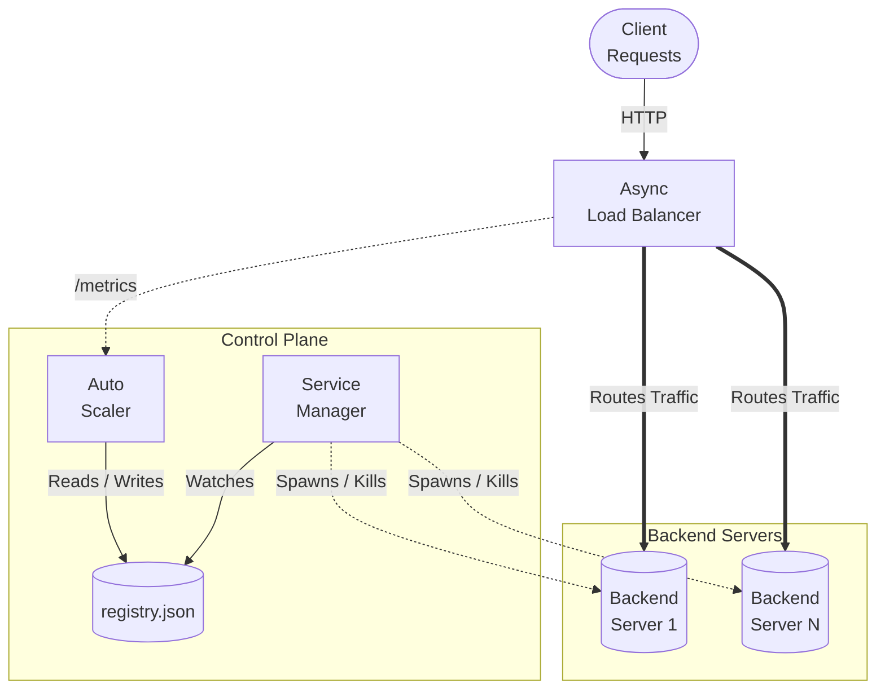

<div align="center">
  # ⚖️ Mini Load Balancer

  *A progressive journey from a simple reverse proxy to a complex, asynchronous, and auto-scaling Load Balancer built purely in Python.*

  [](https://www.python.org/)
  [](https://docs.aiohttp.org/)
  [](https://pypi.org/project/requests/)
</div>

<br>

## 📖 Overview

**Mini Load Balancer** is an educational and practical project demonstrating the core concepts of distributed systems infrastructure. It explores how traffic routing, health monitoring, concurrency, and dynamic scaling work under the hood by implementing progressive versions of a Load Balancer, starting from a naive TCP server and ending with a fully asynchronous auto-scaling system.

---

## ✨ Features and Progression

The repository is structured to show the evolution of a load balancer:

1. **Raw TCP & Reverse Proxy**  
   - 🔌 `tcp_http_server.py`: A raw TCP-level HTTP server handling connections via sockets.
   - 🔀 `reverse_proxy/proxy.py`: A basic reverse proxy forwarding requests to a single backend.

2. **Basic Load Balancing**
   - 🔄 **Round Robin** (`round_robin_lb.py`): Simple HTTP load balancing across multiple active servers sequentially.
   - 💓 **Active Health Checking** (`health_lb.py`): Daemon thread continuously monitors backend `/health` endpoints. Routing only forwards traffic to healthy instances.

3. **Concurrency & Performance**
   - 🧵 **Threaded Load Balancer** (`concurrent_threaded_lb.py`): Uses Python's `ThreadingMixIn` to handle concurrent incoming client connections without blocking.

4. **Advanced & Auto-Scaling (The Async Beast)**
   - ⚡ **Asynchronous LB** (`async_lb.py`): Built with `aiohttp` and `asyncio` for non-blocking high-performance throughput.
   - 🛡️ **Reliability**: Implements Rate Limiting (thresholds per client IP) and automatic request Retries.
   - 📊 **Metrics Endpoint**: Exposes a `/metrics` endpoint detailing `requests_total`, `request_latency`, and `server_requests`.
   - 🚀 **Auto-Scaling** (`auto_scalar.py` & `service_manager.py`): Dynamically reads the metrics. Depending on the traffic load, the autoscaler updates the server configuration (`registry.json`), and the service manager automatically spins up or shuts down backend `server.py` processes.

---

## 🏗️ Architecture (Auto-Scaling Setup)



---

## 🚀 Getting Started

### Prerequisites

You need Python 3.8+ installed. Install the required dependencies:

```bash
pip install -r requirements.txt
```

### Running the Progressive Variations

You can try out any layer of the load balancer. 

#### 1. Basic Examples (Synchronous)
If you want to test the basic round-robin or health-checked load balancer, first start some simple HTTP servers on ports 8001, 8002, 8003 using the standard library or run `tcp_http_server.py`.

```bash
# In one terminal
python load_balancer/round_robin_lb.py

# Or with health checks
python load_balancer/health_lb.py
```

#### 2. The Auto-Scaling Demo (Advanced)
To experience the fully asynchronous, auto-scaling architecture, you need to run three components simultaneously.

1. **Start the Service Manager:** (Reads `registry.json` and spins up the initial backed servers)
   ```bash
   python load_balancer/service_manager.py
   ```

2. **Start the Async Load Balancer:**
   ```bash
   python load_balancer/async_lb.py
   ```

3. **Start the Auto-Scaler:** (Listens to `/metrics` and dynamically scales servers up/down based on load)
   ```bash
   python load_balancer/auto_scalar.py
   ```

Once all are running, send high traffic to `http://localhost:9000` and watch the autoscaler spin up new servers in the service manager terminal!

---

## 🛠️ Built With

- **[Python 3](https://www.python.org/)** - Core logic and networking
- **[aiohttp](https://docs.aiohttp.org/) & [asyncio](https://docs.python.org/3/library/asyncio.html)** - High-performance asynchronous networking
- **[Requests](https://requests.readthedocs.io/)** - Simple HTTP library for synchronous examples

---

<div align="center">
  By an Infrastructure Enthusiast
</div>
